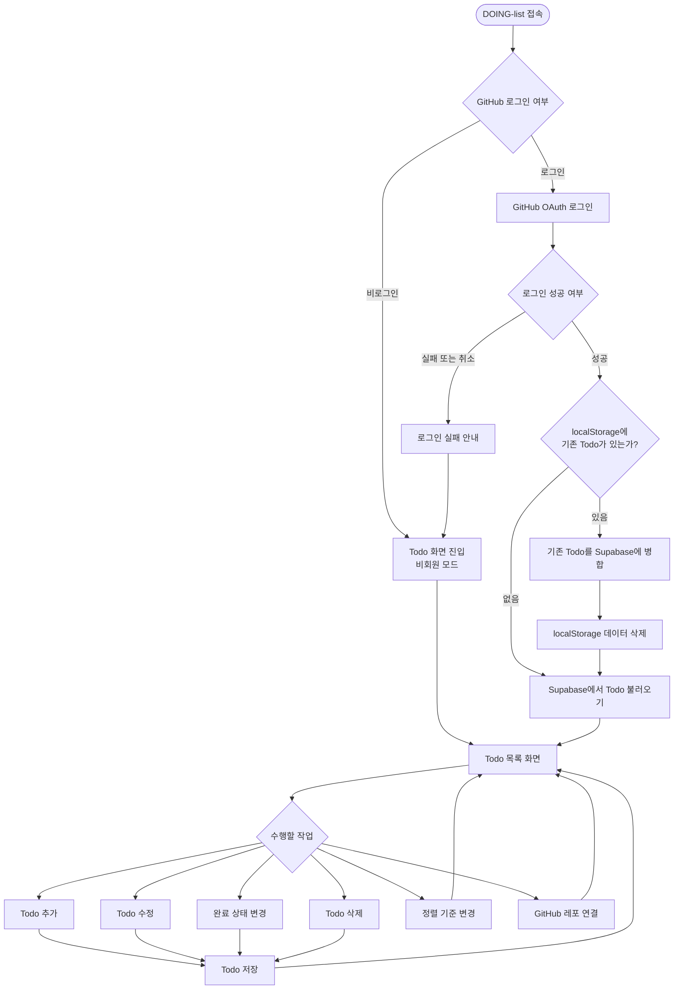
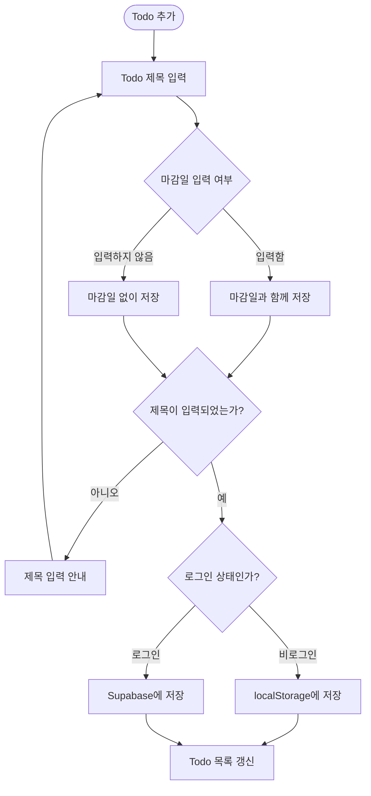
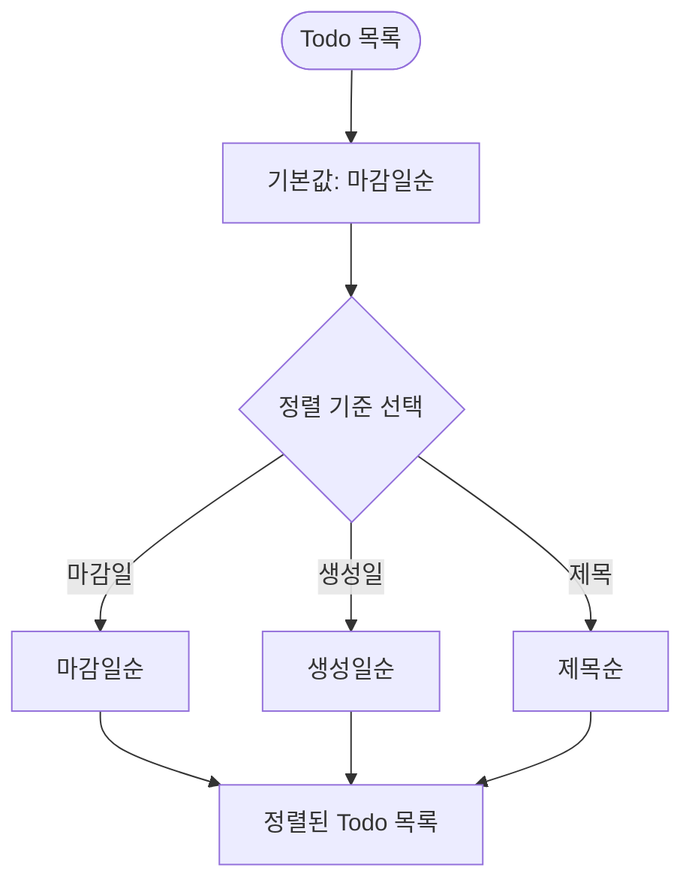
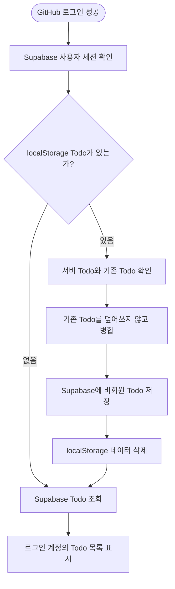
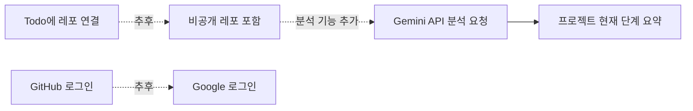

# DOING-list 사용자 흐름

## 기획 범위

### MVP

- GitHub 로그인
- 비로그인 상태의 Todo 작성 및 저장
- 로그인 후 기존 Todo를 Supabase로 이전
- Todo 추가·수정·완료·삭제
- Todo별 GitHub 공개 레포 연결
- GitHub 공개 레포 검색·선택
- 연결한 레포 페이지로 이동
- 마감일·생성일·제목 기준 정렬
- 기본 정렬 기준은 마감일순

### 추후 확장

- 비공개 GitHub 레포 조회
- Google 로그인
- Gemini API를 이용한 레포 분석 및 현재 단계 요약

## 1. 전체 사용자 흐름



## 2. Todo 추가 흐름



## 3. GitHub 공개 레포 연결 흐름

```mermaid
flowchart TD
    LINK([Todo의 레포 연결]) --> CHECK{GitHub 로그인 여부}

    CHECK -->|비로그인| GUIDE[로그인 안내\n"개발자이신가요? GitHub로 로그인해보세요"]
    GUIDE --> OAUTH[GitHub 로그인]
    OAUTH --> RESULT{로그인 성공 여부}
    RESULT -->|실패 또는 취소| RETURN[Todo 화면으로 돌아가기]
    RESULT -->|성공| REPOS[공개 레포 목록 조회]

    CHECK -->|로그인 상태| REPOS
    REPOS --> API{조회 결과}

    API -->|성공| LIST[공개 레포 목록 표시]
    API -->|실패| API_ERROR[레포 목록 조회 실패 안내]
    API_ERROR --> RETURN

    LIST --> SEARCH[레포 이름 검색]
    SEARCH --> RESULT_LIST{검색 결과가 있는가?}
    RESULT_LIST -->|없음| EMPTY[검색 결과 없음]
    EMPTY --> SEARCH
    RESULT_LIST -->|있음| SELECT[레포 선택]

    SELECT --> CONNECT[Todo에 레포 연결]
    CONNECT --> SAVE[연결 정보 저장]
    SAVE --> TODO[Todo에 연결된 레포 표시]
    TODO --> OPEN{GitHub에서 열기}
    OPEN -->|예| GITHUB[GitHub 레포 페이지]
    OPEN -->|아니오| RETURN
```

## 4. 정렬 흐름

정렬 방향을 따로 바꾸는 기능은 제공하지 않는다. 정렬 기준만 선택한다.



### 마감일이 없는 Todo 처리

- 마감일이 없는 Todo도 일반 Todo로 저장한다.
- 마감일이 있는 Todo를 먼저 표시한다.
- 마감일이 없는 Todo는 목록의 마지막에 표시한다.
- 같은 마감일이면 생성일이 빠른 Todo를 먼저 표시한다.

## 5. 로그인 후 데이터 이전



## 6. 예외 상황

| 상황 | 사용자에게 보여줄 처리 |
| --- | --- |
| GitHub 로그인 취소 | 로그인하지 않고 Todo 화면으로 돌아감 |
| GitHub 로그인 실패 | 로그인 실패 메시지 표시 후 재시도 제공 |
| 공개 레포 조회 실패 | 레포를 불러오지 못했다는 안내와 재시도 제공 |
| 레포 검색 결과 없음 | 검색 결과가 없다는 안내 표시 |
| Todo 제목 미입력 | 제목 입력 안내 후 저장하지 않음 |
| Supabase 저장 실패 | 저장 실패 안내 및 재시도 제공 |

## 7. 추후 확장 흐름



## 상세 문서

더 세부적인 상태값과 화면별 흐름은 [docs/user-flow.md](docs/user-flow.md)에서 확인할 수 있다.
