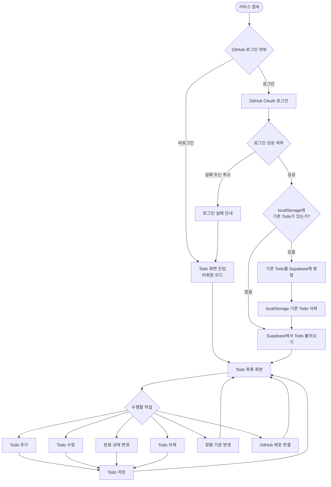
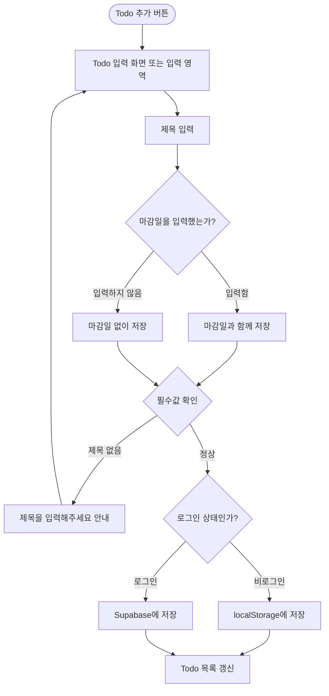
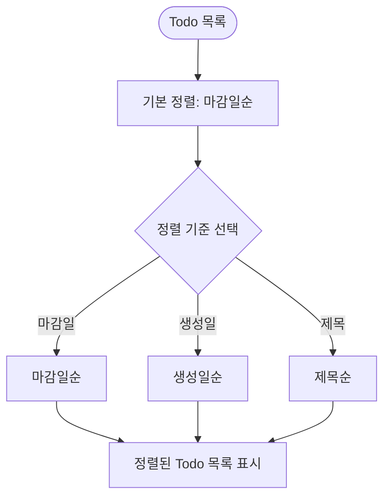
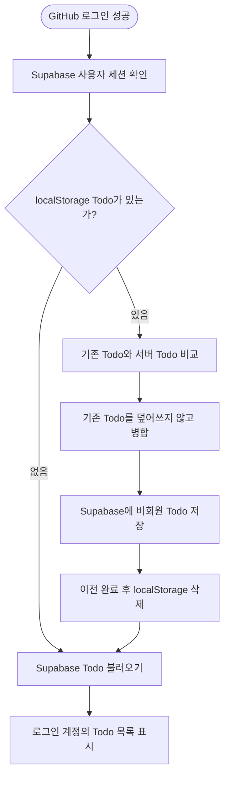
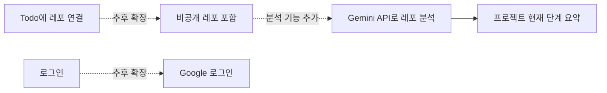

# DOING-list 사용자 흐름

> 현재 기획 기준 사용자 흐름 문서
>
> MVP: GitHub 로그인, 공개 레포 조회·선택, Todo 관리, 정렬, 비로그인 데이터 이전
>
> 확장: 비공개 레포, Google 로그인, Gemini 기반 레포 분석

## 1. MVP 전체 흐름



## 2. Todo 생성·수정 흐름



## 3. GitHub 공개 레포 연결 흐름

```mermaid
flowchart TD
    LINK([Todo의 레포 연결 버튼]) --> CHECK{GitHub 로그인 여부}

    CHECK -->|비로그인| LOGIN_GUIDE[GitHub 로그인 안내\n"개발자이신가요? GitHub로 로그인해보세요"]
    LOGIN_GUIDE --> OAUTH[GitHub OAuth 로그인]
    OAUTH --> OAUTH_RESULT{로그인 성공 여부}
    OAUTH_RESULT -->|실패 또는 취소| RETURN[Todo 화면으로 돌아가기]
    OAUTH_RESULT -->|성공| PUBLIC_REPOS

    CHECK -->|로그인 상태| PUBLIC_REPOS[GitHub 공개 레포 목록 요청]
    PUBLIC_REPOS --> API_RESULT{목록 조회 결과}

    API_RESULT -->|성공| REPO_LIST[공개 레포 목록 표시]
    API_RESULT -->|실패| REPO_ERROR[레포 목록을 불러오지 못했습니다 안내]
    REPO_ERROR --> RETURN

    REPO_LIST --> SEARCH[레포 이름 검색]
    SEARCH --> EMPTY{검색 결과가 있는가?}
    EMPTY -->|없음| NO_RESULT[검색 결과 없음 안내]
    NO_RESULT --> SEARCH
    EMPTY -->|있음| SELECT[레포 선택]

    SELECT --> CONNECT[Todo에 레포 정보 연결]
    CONNECT --> SAVE[연결 정보 저장]
    SAVE --> TODO_DETAIL[Todo 상세 또는 목록에 레포 표시]
    TODO_DETAIL --> OPEN{GitHub 레포를 열 것인가?}
    OPEN -->|예| GITHUB[GitHub 레포 페이지 열기]
    OPEN -->|아니오| RETURN
```

## 4. 정렬 흐름

정렬 방향을 따로 바꾸는 기능은 두지 않는다. 사용자가 기준만 선택하고, 각 기준의 정해진 순서로 표시한다.



### 마감일이 없는 Todo 처리

- 마감일이 있는 Todo는 날짜를 기준으로 정렬한다.
- 마감일이 없는 Todo는 목록의 마지막에 표시한다.
- 마감일이 없는 Todo도 반복 일정이 아니며, 일반 Todo로 저장한다.
- 같은 마감일이면 생성일이 빠른 Todo를 먼저 표시한다.

## 5. 로그인 후 비회원 데이터 이전 흐름



## 6. 화면 구성에 필요한 주요 상태

| 상태 | 용도 |
| --- | --- |
| `isAuthenticated` | GitHub 로그인 상태 확인 |
| `todos` | Todo 목록 관리 |
| `sortOrder` | `deadline`, `createdAt`, `title` 중 현재 기준 |
| `selectedTodoId` | 수정·삭제·레포 연결 대상 Todo |
| `isRepoPickerOpen` | GitHub 레포 선택 영역 표시 여부 |
| `repositories` | 로그인한 사용자의 공개 레포 목록 |
| `repositorySearch` | 레포 검색어 |
| `isLoading` | Todo·레포 조회 중 로딩 상태 |
| `error` | 로그인·저장·조회 실패 메시지 |

## 7. MVP에서 제외하고 확장할 흐름

현재 흐름은 공개 레포만 대상으로 한다. 아래 기능은 기본 데이터 구조를 유지하면서 추후 추가한다.



## 8. FigJam으로 옮길 때의 영역 배치

FigJam에서는 아래 순서로 영역을 나누면 된다.

1. **진입·로그인 영역**: 서비스 접속 → 비로그인 또는 GitHub 로그인
2. **Todo 관리 영역**: 추가 → 수정 → 완료 → 삭제
3. **레포 연결 영역**: 공개 레포 조회 → 검색 → 선택 → 연결
4. **정렬 영역**: 마감일순·생성일순·제목순
5. **데이터 이전 영역**: localStorage → Supabase 병합
6. **확장 영역**: 비공개 레포·Google 로그인·Gemini 분석

실선은 MVP 흐름, 점선은 추후 확장 흐름으로 표시한다.
